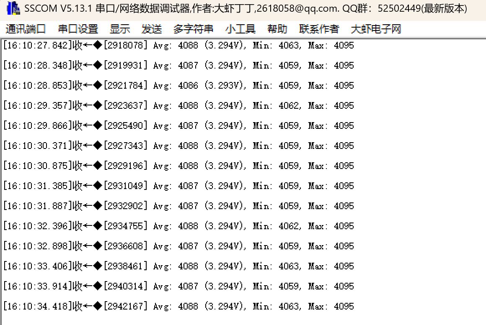
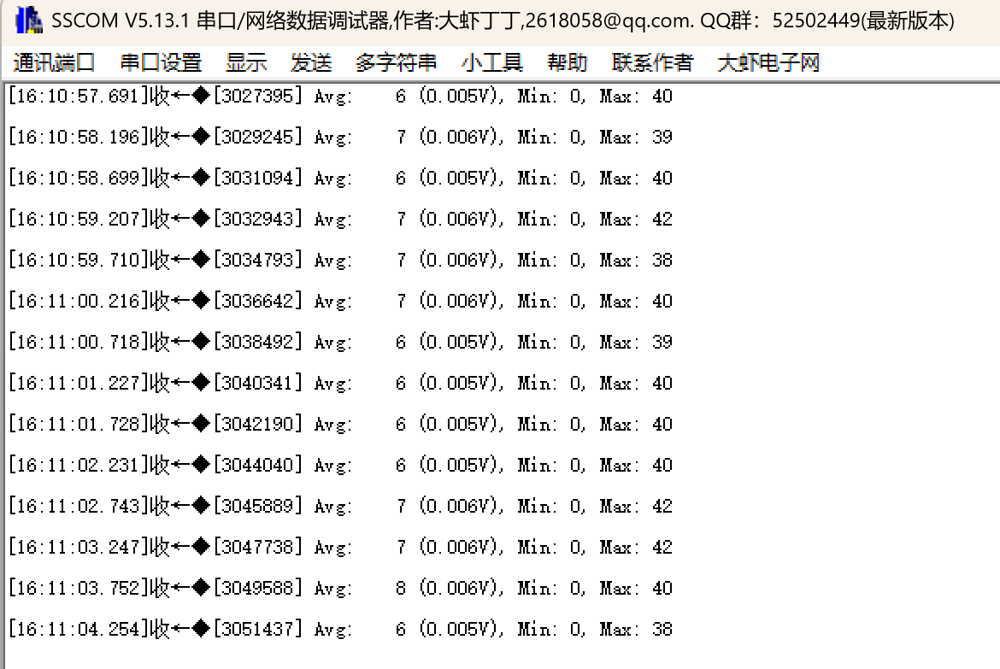

# adcDma : ADC DMA方式采集

## 功能说明

DMA (Direct Memory Access) 方式：**硬件自动搬运数据，CPU零负担**。

ADC连续转换64次，DMA自动将数据存入缓冲区，全程CPU不参与。

## 三种方式对比

| 特性 | 轮询 | 中断 | DMA |
|------|------|------|-----|
| CPU参与 | 全程等待 | 每次转换响应 | **仅启动和读取** |
| 效率 | 低 | 中 | **高** |
| 适合场景 | 偶尔采集 | 单次采集 | **高速/批量采集** |
| 代码复杂度 | 简单 | 中等 | 稍复杂 |

## 工作原理

```
轮询 (每次转换CPU都等待):
CPU:  [启动][等待][读取]  [启动][等待][读取]  [启动][等待][读取]
       ████████████       ████████████       ████████████


中断 (每次转换CPU响应一次):
CPU:  [启动]    [中断]    [中断]    [中断]  ...
ADC:       [转换]    [转换]    [转换]
                ↑         ↑         ↑
              64次中断 = 64次CPU介入


DMA (N次转换后CPU才介入一次):
CPU:  [启动]                              [中断-读取]
ADC:       [转换][转换][转换]...[转换]
DMA:            ↓    ↓    ↓        ↓
            Buffer[0][1][2]...[63]
                                    ↑
                              仅1次中断！
```

## 硬件连接

| 引脚 | 功能 | 连接 |
|------|------|------|
| PA0 | ADC1_IN0 | 接3.3V或GND |
| PA9 | USART1_TX | 串口输出 |

## CubeMX配置

### 1. ADC1基本配置

**Pinout: PA0 → ADC1_IN0**

**Analog → ADC1 → Parameter Settings:**

| 参数 | 值 | 说明 |
|------|-----|------|
| Clock Prescaler | PCLK2 divided by 4 | |
| Resolution | 12 bits | |
| Scan Conversion Mode | Disabled | 单通道 |
| **Continuous Conversion Mode** | **Enabled** | **关键！连续转换** |
| DMA Continuous Requests | **Enabled** | **关键！** |

**ADC_Regular_ConversionMode:**

| 参数 | 值 |
|------|-----|
| Number Of Conversion | 1 |
| External Trigger | Software Trigger |
| Rank 1 Channel | Channel 0 |
| Rank 1 Sampling Time | 84 Cycles |

### 2. DMA配置 (关键!)

**Analog → ADC1 → DMA Settings:**

点击 **Add** 按钮添加DMA请求：

| 参数 | 值 | 说明 |
|------|-----|------|
| DMA Request | ADC1 | |
| Stream | DMA2 Stream 0 | 或 Stream 4 |
| Direction | Peripheral To Memory | 外设→内存 |
| Priority | Low | |

**DMA Request Settings:**

| 参数 | 值 | 说明 |
|------|-----|------|
| Mode | **Circular** | **循环模式，自动重新开始** |
| Peripheral Increment | Disabled | ADC数据寄存器地址固定 |
| Memory Increment | **Enabled** | **内存地址递增** |
| Peripheral Data Width | Half Word | 16位 |
| Memory Data Width | Half Word | 16位 |

### 3. NVIC配置

**System Core → NVIC:**

| 中断 | 使能 |
|------|------|
| DMA2 Stream0 global interrupt | ✓ |

**注意：** DMA方式主要靠DMA中断，ADC中断可以不开。

### 4. 配置示意图

```
┌─────────────────────────────────────────────────────┐
│                      CubeMX                         │
├─────────────────────────────────────────────────────┤
│  ADC1:                                              │
│  ├── Continuous Conversion: Enabled                 │
│  ├── DMA Continuous Requests: Enabled               │
│  │                                                  │
│  └── DMA Settings:                                  │
│      ├── Stream: DMA2 Stream 0                      │
│      ├── Direction: Peripheral to Memory            │
│      ├── Mode: Circular        ← 循环模式           │
│      ├── Memory Increment: Enabled                  │
│      └── Data Width: Half Word (16-bit)             │
│                                                     │
│  NVIC:                                              │
│  └── DMA2 Stream0 global interrupt: Enabled         │
└─────────────────────────────────────────────────────┘
```

## 代码使用

### main.c

```c
/* USER CODE BEGIN Includes */
#include "adc_dma.h"
#include <stdio.h>
/* USER CODE END Includes */

/* USER CODE BEGIN 0 */
int fputc(int ch, FILE *f)
{
    HAL_UART_Transmit(&huart1, (uint8_t *)&ch, 1, 10);
    return ch;
}
/* USER CODE END 0 */

int main(void)
{
    HAL_Init();
    SystemClock_Config();
    MX_GPIO_Init();
    MX_DMA_Init();      /* 注意：DMA初始化必须在ADC之前！ */
    MX_ADC1_Init();
    MX_USART1_UART_Init();
    
    /* USER CODE BEGIN 2 */
    printf("\r\n===== ADC DMA Demo =====\r\n");
    printf("Buffer size: %d samples\r\n\r\n", ADC_DMA_BUF_SIZE);
    
    ADC_DMA_Init(&hadc1);
    ADC_DMA_Start();
    /* USER CODE END 2 */
    
    while (1)
    {
        /* USER CODE BEGIN 3 */
        
        if (ADC_DMA_IsDataReady()) {
            ADC_DMA_Result_t result;
            ADC_DMA_GetResult(&result);
            
            printf("[%lu] Avg: %4d (%.3fV), Min: %d, Max: %d\r\n",
                   ADC_DMA_GetCompleteCount(),
                   result.raw,
                   result.voltage,
                   result.min,
                   result.max);
        }
        
        HAL_Delay(500);
        
        /* USER CODE END 3 */
    }
}
```

### 重要：初始化顺序

CubeMX生成的代码中，**DMA初始化必须在ADC初始化之前**：

```c
MX_DMA_Init();    /* 先初始化DMA */
MX_ADC1_Init();   /* 再初始化ADC */
```

如果顺序错误，DMA不会工作！

## 预期结果

```
===== ADC DMA Demo =====
Buffer size: 64 samples

[1] Avg: 4095 (3.300V), Min: 4095, Max: 4095
[2] Avg: 4095 (3.300V), Min: 4095, Max: 4095
[3] Avg: 4095 (3.300V), Min: 4093, Max: 4095
...
```

- `[n]`: DMA传输完成次数
- `Avg`: 64次采样平均值
- `Min/Max`: 最小/最大值 (可观察噪声)

## DMA模式说明

### Circular (循环) vs Normal (普通)

```
Normal模式:
Buffer: [0][1][2]...[63] → 停止
                          ↑
                     需要重新启动

Circular模式:
Buffer: [0][1][2]...[63] → [0][1][2]...[63] → [0][1]...
                     ↑                   ↑
                  中断通知            自动重新开始
```

本DEMO使用Circular模式，启动一次后持续运行。

### 半传输中断 (可选)

如果需要更快响应，可以用半传输中断：

```c
void HAL_ADC_ConvHalfCpltCallback(ADC_HandleTypeDef *hadc)
{
    /* Buffer前半部分 [0~31] 已填满 */
}

void HAL_ADC_ConvCpltCallback(ADC_HandleTypeDef *hadc)
{
    /* Buffer后半部分 [32~63] 已填满 */
}
```

## 常见问题

**Q: DMA不工作，回调不触发?**

A: 检查：
1. MX_DMA_Init() 是否在 MX_ADC1_Init() **之前**调用
2. DMA中断是否使能
3. DMA Stream配置是否正确

**Q: 数据全是0?**

A:
1. Continuous Conversion Mode 是否 Enabled
2. DMA Continuous Requests 是否 Enabled
3. Memory Increment 是否 Enabled

**Q: 只有第一个数据正确?**

A: Memory Increment 没有使能，所有数据写到同一位置

**Q: 如何单次DMA采集 (不循环)?**

A: 
1. DMA Mode 改为 Normal
2. 每次需要采集时调用 ADC_DMA_Start()

## DMA与采样率

```
采样率计算:
ADC时钟 = 90MHz / 4 = 22MHz
单次转换 = (84 + 12) cycles = 96 cycles
转换时间 = 96 / 22MHz ≈ 4.36μs
采样率 ≈ 229 kSPS

64个样本耗时 = 64 × 4.36μs ≈ 279μs
```

## 高级用法：双缓冲

```c
/* 使用两个缓冲区交替 */
uint16_t buffer_A[64];
uint16_t buffer_B[64];

/* 半传输中断处理A，完成中断处理B */
```


## 文件结构

```
adcDma/
├── Core/
│   ├── Inc/
│   │   └── adc_dma.h
│   └── Src/
│       └── adc_dma.c
└── README.md
```

## 实验现象

### PA0接3.3V



### PA0接GND


