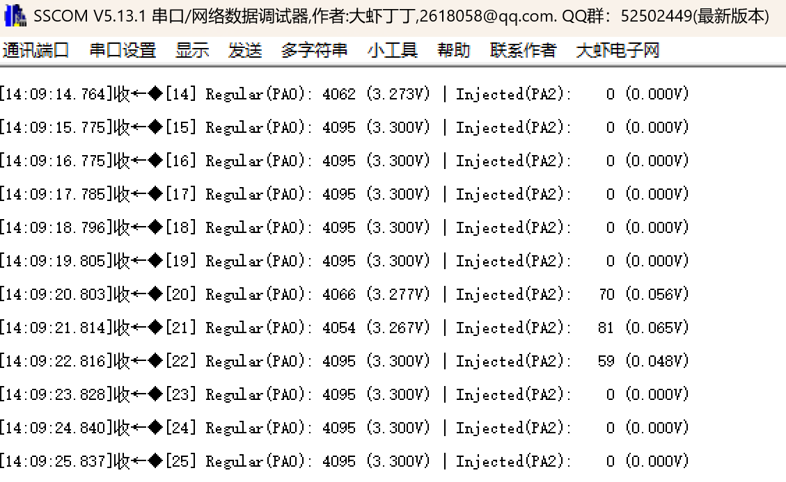

# adcInjected: ADC注入通道 - 高优先级采样

## 功能说明

注入通道(Injected Channel)可以**打断正在进行的规则通道转换**，实现高优先级采样。

类似于中断可以打断主程序一样。

## 规则通道 vs 注入通道

| 特性       | 规则通道 (Regular) | 注入通道 (Injected)   |
| ---------- | ------------------ | --------------------- |
| 最大通道数 | 16                 | **4**                 |
| 优先级     | 普通               | **高 (可打断规则)**   |
| 数据寄存器 | 1个共用 (DR)       | **4个独立 (JDR1~4)**  |
| DMA支持    | 支持               | 不支持                |
| 适用场景   | 连续/批量采集      | **紧急/高优先级采样** |

## 工作模式说明

```
规则通道: 连续转换 + 轮询读取 (后台持续运行)
注入通道: 软件触发 + 中断回调 (高优先级打断)

时间线:
规则通道:  [转换][转换][转换]...[暂停]...[转换][转换]...
                              ↑      ↑
注入通道:                    触发   完成
                            打断规则 恢复规则
```

## 应用场景

| 场景        | 说明                      |
| ----------- | ------------------------- |
| 电机FOC控制 | PWM中心点触发采集三相电流 |
| 过流保护    | 比较器触发，立即采样电流  |
| 紧急测量    | 软件需要立即获取某个值    |
| 同步采样    | 外部事件触发精确时刻采样  |

## 硬件连接

| 引脚 | 功能            | 连接   |
| ---- | --------------- | ------ |
| PA0  | ADC1_IN0 (规则) | 接3.3V |
| PA2  | ADC1_IN2 (注入) | 接GND  |
| PA9  | USART1_TX       | 串口   |

## CubeMX配置

### 1. ADC1基本配置

**Pinout: PA0 → ADC1_IN0, PA2 → ADC1_IN2**

**Analog → ADC1 → Parameter Settings:**

| 参数                       | 值                 |
| -------------------------- | ------------------ |
| Clock Prescaler            | PCLK2 divided by 4 |
| Resolution                 | 12 bits            |
| Scan Conversion Mode       | Disabled           |
| Continuous Conversion Mode | Enabled            |
| DMA Continuous Requests    | Disabled           |

### 2. 规则通道配置

**ADC_Regular_ConversionMode:**

| 参数                 | 值               |
| -------------------- | ---------------- |
| Number Of Conversion | 1                |
| External Trigger     | Software Trigger |
| Rank 1 Channel       | **Channel 0**    |
| Rank 1 Sampling Time | 84 Cycles        |

### 3. 注入通道配置 (关键!)

**ADC_Injected_ConversionMode:**

| 参数                     | 值                | 说明         |
| ------------------------ | ----------------- | ------------ |
| **Number Of Conversion** | **1**             | 注入通道数量 |
| External Trigger         | Software Trigger  | 或外部触发   |
| Injected Conversion Mode | **Discontinuous** |              |

展开 **Rank 1:**

| 参数          | 值            |
| ------------- | ------------- |
| Channel       | **Channel 1** |
| Sampling Time | 84 Cycles     |

### 4. NVIC配置

**System Core → NVIC:**

| 中断                                  | 使能 | 说明           |
| ------------------------------------- | ---- | -------------- |
| ADC1, ADC2 and ADC3 global interrupts | ✓    | 两种回调都需要 |

### 5. 配置示意图

```
┌─────────────────────────────────────────────────────┐
│                    ADC1 配置                        │
├─────────────────────────────────────────────────────┤
│                                                     │
│  Regular Channel (规则通道):                        │
│  ├── Number: 1                                      │
│  ├── Channel: IN0 (PA0)         ← 普通采集         │
│  └── Continuous: Enabled                            │
│                                                     │
│  Injected Channel (注入通道):     ← 新增配置       │
│  ├── Number: 1                                      │
│  └── Channel: IN2 (PA2)         ← 高优先级采集     │
│                                                     │
│  NVIC:                                              │
│  └── ADC global interrupt: Enabled                  │
│                                                     │
└─────────────────────────────────────────────────────┘
```

## 代码使用

### main.c

```c
/* USER CODE BEGIN Includes */
#include "adc_injected.h"
#include <stdio.h>
/* USER CODE END Includes */

/* USER CODE BEGIN 0 */
int fputc(int ch, FILE *f)
{
    HAL_UART_Transmit(&huart1, (uint8_t *)&ch, 1, 10);
    return ch;
}
/* USER CODE END 0 */

int main(void)
{
    HAL_Init();
    SystemClock_Config();
    MX_GPIO_Init();
    MX_ADC1_Init();
    MX_USART1_UART_Init();

    /* USER CODE BEGIN 2 */
    ADC_Inj_Init(&hadc1);
    ADC_Inj_StartRegular();
    /* USER CODE END 2 */

    while (1)
    {
        /* USER CODE BEGIN 3 */
        /* 触发注入通道 */
        ADC_Inj_TriggerInjected();
        while (!ADC_Inj_IsInjectedReady());

        /* 获取结果 */
        ADC_Injected_Result_t result;
        ADC_Inj_GetResult(&result);

        printf("Injected: %4d (%.3fV)\r\n",
               result.injected_raw, result.injected_voltage);

        HAL_Delay(1000);

        /* USER CODE END 3 */
    }
}
```

## 预期结果

```
===== ADC Injected Channel Demo =====
Regular: PA0 (continuous)
Injected: PA1 (high priority)

Regular: 4088, 4091, 4087 | Injected:    5 (0.004V)
Regular: 4090, 4089, 4092 | Injected:    3 (0.002V)
Regular: 4087, 4090, 4088 | Injected:    4 (0.003V)
...
```
- 注入后Regular仍在变化 → 说明恢复成功
- Injected(PA1): 接GND，持续在0V附近

## 外部触发注入通道

除了软件触发，还可以用外部信号触发：

### 定时器触发

```
CubeMX:
ADC_Injected_ConversionMode:
└── External Trigger: Timer 1 Trigger Out event
```

### GPIO外部中断触发

```
CubeMX:
ADC_Injected_ConversionMode:
└── External Trigger: EXTI line 15
```

### PWM中心触发 (电机控制常用)

```
TIM1 PWM模式:
├── TRGO: OC4REF (比较匹配时触发)
│
ADC1:
└── Injected Trigger: Timer 1 Trigger Out event

效果: PWM中心点自动触发ADC采集电流
```

## 注入通道独立寄存器的优势

```
规则通道 (共用DR):
转换1 → DR = 1000
转换2 → DR = 2000  ← 覆盖了转换1的结果！
                     必须及时读取或用DMA

注入通道 (独立JDRx):
注入转换1 → JDR1 = 1000
注入转换2 → JDR2 = 2000  ← 不会覆盖！
注入转换3 → JDR3 = 3000
注入转换4 → JDR4 = 4000
                     可以在任意时间读取
```

## 多个注入通道

最多配置4个注入通道：

```c
/* CubeMX配置 Number Of Conversion = 4 */

/* 读取4个注入通道值 */
uint16_t inj1 = HAL_ADCEx_InjectedGetValue(&hadc1, ADC_INJECTED_RANK_1);
uint16_t inj2 = HAL_ADCEx_InjectedGetValue(&hadc1, ADC_INJECTED_RANK_2);
uint16_t inj3 = HAL_ADCEx_InjectedGetValue(&hadc1, ADC_INJECTED_RANK_3);
uint16_t inj4 = HAL_ADCEx_InjectedGetValue(&hadc1, ADC_INJECTED_RANK_4);
```

## 常见问题

**Q: 注入通道回调不触发？**

A:
1. 检查ADC中断是否使能
2. 确认使用 `HAL_ADCEx_InjectedStart_IT()` 而不是 `_Start()`
3. 确认 `HAL_ADCEx_InjectedConvCpltCallback` 函数名正确

**Q: 规则通道被打断后停止更新？**

A: 详情见blog：[ADC调试踩坑：一个printf引发的“血案”](https://blog.csdn.net/weixin_45716353/article/details/156025275?spm=1001.2014.3001.5501)


**Q: 注入通道可以用DMA吗？**

A: 不行，注入通道不支持DMA，必须在回调里读取

**Q: 最多几个注入通道？**

A: 4个，通过JDR1~JDR4寄存器存储

## 文件结构

```
adcInjected/
├── Core/
│   ├── Inc/
│   │   └── adc_injected.h
│   └── Src/
│       └── adc_injected.c
└── README.md
```

## 实验效果


