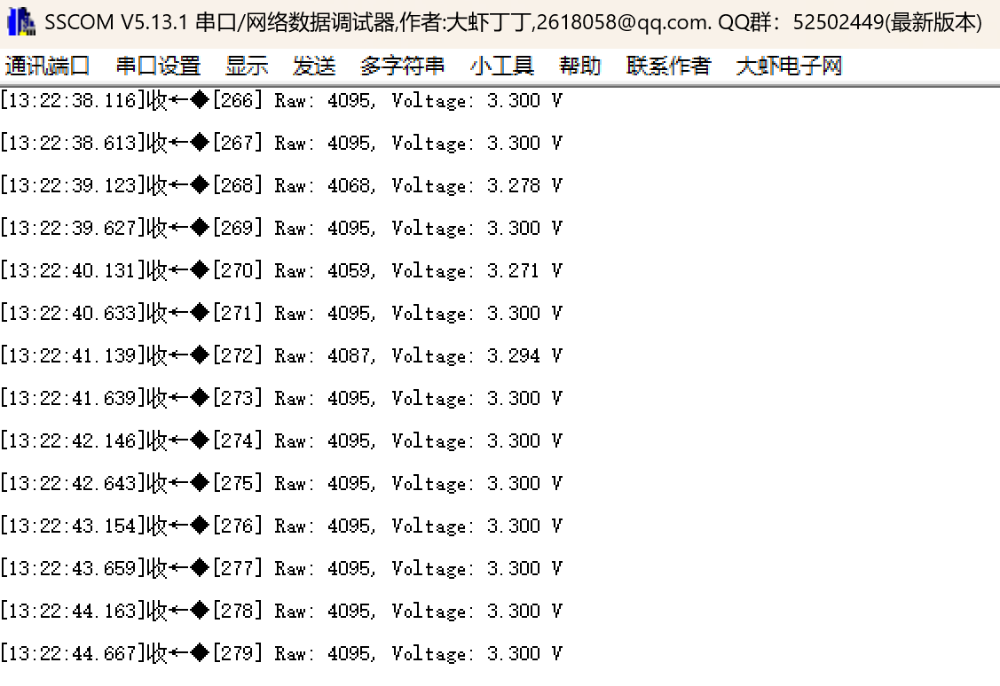
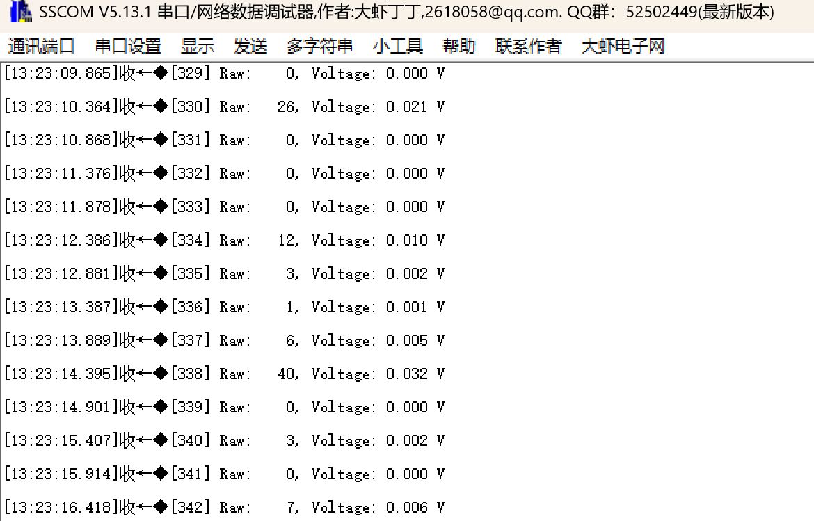

# Adc Interrupt: ADC中断方式采集

## 功能说明

ADC转换完成后通过**中断通知CPU**，主循环不需要等待。

## 轮询 vs 中断

| 特性 | 轮询方式 | 中断方式 |
|------|---------|---------|
| CPU等待 | 阻塞等待转换完成 | **无需等待** |
| 效率 | 低 | 高 |
| 代码复杂度 | 简单 | 稍复杂 |
| 适用场景 | 低速/简单应用 | 实时性要求高 |

## 时序对比

```
轮询方式:
主循环:  ───[Start]─[等待]─[GetValue]───────[Start]─[等待]─...
             ↑        ↑
            CPU      CPU
           启动      等待


中断方式:
主循环:  ───[Start]─[做其他事情]─────[检查并读取]───[Start]─...
                                         ↑
ADC:        └──[采样][转换]──→ EOC中断 ──┘
                (4μs)         ↓
                          回调函数保存结果
```

## 硬件连接

| 引脚 | 功能 | 连接 |
|------|------|------|
| PA0 | ADC1_IN0 | 接3.3V或GND |
| PA9 | USART1_TX | 串口输出 |

## CubeMX配置

### 1. ADC1配置

**Pinout: PA0 → ADC1_IN0**

**Analog → ADC1 → Parameter Settings:**

| 参数 | 值 |
|------|-----|
| Clock Prescaler | PCLK2 divided by 4 |
| Resolution | 12 bits |
| Scan Conversion Mode | Disabled |
| Continuous Conversion Mode | Disabled |
| Discontinuous Conversion Mode | Disabled |
| DMA Continuous Requests | Disabled |

**ADC_Regular_ConversionMode:**

| 参数 | 值 |
|------|-----|
| Number Of Conversion | 1 |
| External Trigger | Software Trigger |
| Rank 1 Channel | Channel 0 |
| Rank 1 Sampling Time | 84 Cycles |

### 2. NVIC配置 (关键!)

**Analog → ADC1 → NVIC Settings:**

| 中断 | 使能 |
|------|------|
| ADC1, ADC2 and ADC3 global interrupts | ✓ **必须勾选** |

### 3. USART1配置

```
Mode: Asynchronous
Baud Rate: 115200
```

## 代码使用

### main.c

```c
/* USER CODE BEGIN Includes */
#include "adc_it.h"
#include <stdio.h>
/* USER CODE END Includes */

/* USER CODE BEGIN 0 */
int fputc(int ch, FILE *f)
{
    HAL_UART_Transmit(&huart1, (uint8_t *)&ch, 1, 10);
    return ch;
}
/* USER CODE END 0 */

int main(void)
{
    HAL_Init();
    SystemClock_Config();
    MX_GPIO_Init();
    MX_ADC1_Init();
    MX_USART1_UART_Init();
    
    /* USER CODE BEGIN 2 */
    printf("\r\n===== ADC Interrupt Demo =====\r\n");
    ADC_IT_Init(&hadc1);
    /* USER CODE END 2 */
    
    while (1)
    {
        /* USER CODE BEGIN 3 */
        
        /* 触发一次转换 (非阻塞，立即返回) */
        ADC_IT_StartConversion();
        
        /* 可以做其他事情... */
        /* DoSomethingElse(); */
        
        /* 检查结果 */
        ADC_Result_t result;
        if (ADC_IT_GetResult(&result)) {
            printf("[%lu] Raw: %4d, Voltage: %.3f V\r\n",
                   ADC_IT_GetConversionCount(),
                   result.raw, 
                   result.voltage);
        }
        
        HAL_Delay(500);
        
        /* USER CODE END 3 */
    }
}
```

## 预期结果

```
===== ADC Interrupt Demo =====
[1] Raw: 4095, Voltage: 3.300 V
[2] Raw: 4095, Voltage: 3.300 V
[3] Raw: 4095, Voltage: 3.300 V
...
```

方括号里的数字是转换次数，持续增加说明中断正常工作。

## 进阶：连续转换模式

如果需要连续采集，可以开启连续转换：

**CubeMX修改:**
```
Continuous Conversion Mode: Enabled
```

**代码修改:**
```c
/* 只需启动一次，ADC会持续转换 */
HAL_ADC_Start_IT(&hadc1);

while (1)
{
    if (ADC_IT_IsDataReady()) {
        ADC_Result_t result;
        ADC_IT_GetResult(&result);
        printf("Voltage: %.3f V\r\n", result.voltage);
    }
    /* 不需要再次StartConversion */
}
```

## 常见问题

**Q: 回调函数没有被调用?**

A: 
1. 检查NVIC中ADC中断是否使能
2. 检查stm32f4xx_it.c中ADC_IRQHandler是否存在
3. 确认使用的是`HAL_ADC_Start_IT()`而不是`HAL_ADC_Start()`

**Q: 数据一直不就绪?**

A: 在回调函数里打断点，确认中断是否触发

**Q: 中断里能做复杂操作吗?**

A: 不建议。中断应尽快返回，只做数据保存。复杂处理放在主循环。


## 文件结构

```
adcInterrupt/
├── Core/
│   ├── Inc/
│   │   └── adc_it.h
│   └── Src/
│       └── adc_it.c
└── README.md
```

## 实验现象

### PA0接3.3V



### PA0接GND

