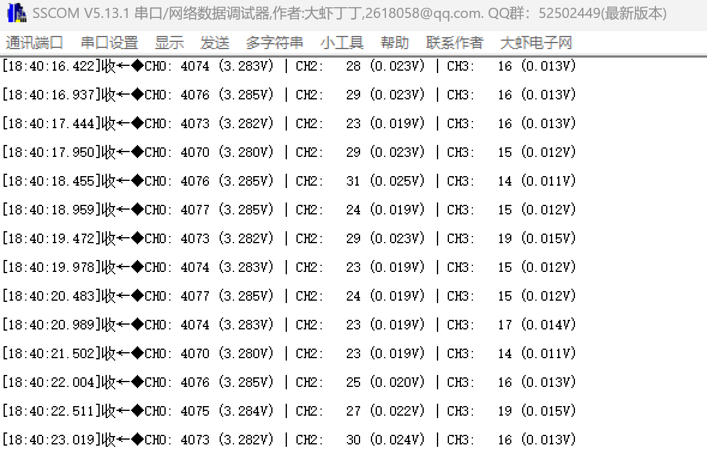

# adcMultichannel: ADC多通道扫描采集

## 功能说明

同时采集**多个ADC通道**，DMA自动搬运所有通道数据。

本DEMO配置3个通道：PA0、PA2、PA3

## 应用场景

| 场景 | 说明 |
|------|------|
| 多路传感器 | 温度+湿度+光照 |
| 电池管理 | 电压+电流+温度 |
| 电机控制 | 三相电流采样 |
| 摇杆输入 | X轴+Y轴+按键 |

## 扫描模式原理

```
单通道:
  [CH0] [CH0] [CH0] [CH0] ...


扫描模式 (3通道):
  [CH0] [CH1] [CH2] [CH0] [CH1] [CH2] [CH0] [CH1] [CH2] ...
  │←── 一轮扫描 ──→│←── 一轮扫描 ──→│←── 一轮扫描 ──→│
```

## DMA缓冲区数据排列

```
采样16轮，3通道，缓冲区大小 = 16 × 3 = 48

Buffer索引:  [0]  [1]  [2]  [3]  [4]  [5]  ... [45] [46] [47]
通道:        CH0  CH1  CH2  CH0  CH1  CH2  ... CH0  CH1  CH2
轮次:        ←─ 第1轮 ─→  ←─ 第2轮 ─→      ←─ 第16轮 ─→

提取CH1所有数据: Buffer[1], Buffer[4], Buffer[7], ... Buffer[46]
                 索引规律: i * 3 + 1  (i = 0,1,2...15)
```

## 硬件连接

| 引脚 | ADC通道 | 测试连接 |
|------|---------|---------|
| PA0 | ADC1_IN0 | 接 3.3V |
| PA2 | ADC1_IN2 | 接 GND |
| PA3 | ADC1_IN3 | 接 GND |
| PA9 | USART1_TX | 串口 |

## CubeMX配置

### 1. 引脚配置

**Pinout视图中点击引脚：**

- PA0 → ADC1_IN0
- PA2 → ADC1_IN2
- PA3 → ADC1_IN3

### 2. ADC1配置

**Analog → ADC1 → Parameter Settings:**

| 参数 | 值 | 说明 |
|------|-----|------|
| Clock Prescaler | PCLK2 divided by 4 | |
| Resolution | 12 bits | |
| **Scan Conversion Mode** | **Enabled** | **关键！启用扫描** |
| Continuous Conversion Mode | Enabled | 连续转换 |
| DMA Continuous Requests | Enabled | |
| End Of Conversion Selection | EOC flag at the end of all conversions | |

### 3. 通道配置

**ADC_Regular_ConversionMode:**

| 参数 | 值 |
|------|-----|
| **Number Of Conversion** | **3** |
| External Trigger | Software Trigger |

展开后配置每个Rank：

**Rank 1:**
| 参数 | 值 |
|------|-----|
| Channel | Channel 0 |
| Sampling Time | 84 Cycles |

**Rank 2:**
| 参数 | 值 |
|------|-----|
| Channel | Channel 2 |
| Sampling Time | 84 Cycles |

**Rank 3:**
| 参数 | 值 |
|------|-----|
| Channel | Channel 3 |
| Sampling Time | 84 Cycles |

### 4. DMA配置

**DMA Settings → Add:**

| 参数 | 值 |
|------|-----|
| DMA Request | ADC1 |
| Stream | DMA2 Stream 0 |
| Direction | Peripheral To Memory |
| Priority | Low |

**DMA Request Settings:**

| 参数 | 值 |
|------|-----|
| Mode | Circular |
| Peripheral Increment | Disabled |
| Memory Increment | Enabled |
| Peripheral Data Width | Half Word |
| Memory Data Width | Half Word |

### 5. NVIC配置

| 中断 | 使能 |
|------|------|
| DMA2 Stream0 global interrupt | ✓ |

### 6. 配置示意图

```
┌─────────────────────────────────────────────────────┐
│                    ADC1 配置                        │
├─────────────────────────────────────────────────────┤
│  Mode:                                              │
│  ├── IN0: ✓                                         │
│  ├── IN1: ✓                                         │
│  └── IN2: ✓                                         │
│                                                     │
│  Parameter Settings:                                │
│  ├── Scan Conversion Mode: Enabled    ← 扫描模式     │
│  ├── Continuous Conversion: Enabled                 │
│  └── Number Of Conversion: 3          ← 3个通道      │
│                                                     │
│  Rank配置:                                          │
│  ├── Rank 1: Channel 0                              │
│  ├── Rank 2: Channel 2                              │
│  └── Rank 3: Channel 3                              │
│                                                     │
│  DMA:                                               │
│  └── Circular, Memory Increment                     │
└─────────────────────────────────────────────────────┘
```

## 代码使用

### main.c

```c
/* USER CODE BEGIN Includes */
#include "adc_multichannel.h"
#include <stdio.h>
/* USER CODE END Includes */

/* USER CODE BEGIN 0 */
int fputc(int ch, FILE *f)
{
    HAL_UART_Transmit(&huart1, (uint8_t *)&ch, 1, 10);
    return ch;
}
/* USER CODE END 0 */

int main(void)
{
    HAL_Init();
    SystemClock_Config();
    MX_GPIO_Init();
    MX_DMA_Init();       /* DMA必须在ADC之前初始化 */
    MX_ADC1_Init();
    MX_USART1_UART_Init();
    
    /* USER CODE BEGIN 2 */
    ADC_Multi_Init(&hadc1);
    ADC_Multi_Start();
    /* USER CODE END 2 */
    
    while (1)
    {
        /* USER CODE BEGIN 3 */
        
        if (ADC_Multi_IsDataReady()) {
            ADC_MultiResult_t result;
            ADC_Multi_GetResult(&result);
            
            printf("CH0: %4d (%.3fV) | CH2: %4d (%.3fV) | CH3: %4d (%.3fV)\r\n",
                   result.ch[0].raw, result.ch[0].voltage,
                   result.ch[1].raw, result.ch[1].voltage,
                   result.ch[2].raw, result.ch[2].voltage);
        }
        
        HAL_Delay(500);
        
        /* USER CODE END 3 */
    }
}
```

## 扩展到更多通道

### 修改头文件

```c
#define ADC_CHANNEL_COUNT   4   /* 改为4通道 */
```

### CubeMX添加通道

```
Number Of Conversion: 4
Rank 4: Channel 4 (PA4)
```

### 最多支持16通道

STM32F429的ADC1最多支持16个通道（IN0~IN15），加上内部通道（温度、VREF、VBAT）。

## 通道采样顺序

**Rank决定采样顺序：**

```
Rank 1 → 最先采样
Rank 2 → 第二
Rank 3 → 第三
...

可以配置任意顺序：
Rank 1: Channel 5
Rank 2: Channel 0
Rank 3: Channel 3

采样顺序: CH5 → CH0 → CH3 → CH5 → CH0 → CH3 → ...
```

## 不同通道不同采样时间

对于不同特性的信号，可以配置不同采样时间：

```
Rank 1 (高频信号):   Channel 0, Sampling Time: 3 Cycles
Rank 2 (高阻抗源):   Channel 1, Sampling Time: 480 Cycles
Rank 3 (普通信号):   Channel 2, Sampling Time: 84 Cycles
```

## 常见问题

**Q: 所有通道数据一样？**

A: 
1. 检查Scan Conversion Mode是否Enabled
2. 检查Number Of Conversion是否正确
3. 检查每个Rank的Channel配置

**Q: 只有第一个通道有数据？**

A:
1. DMA Memory Increment必须Enabled
2. 缓冲区大小要 = 通道数 × 采样次数

**Q: 通道顺序不对？**

A: 检查Rank配置顺序，Rank 1是第一个采样的通道

**Q: 某个通道数据不稳定？**

A: 
1. 检查该通道引脚是否悬空
2. 增加该通道的采样时间

## 与单通道DMA对比

| 特性 | 单通道DMA | 多通道DMA |
|------|----------|----------|
| Scan Mode | Disabled | **Enabled** |
| Number Of Conversion | 1 | **N** |
| 缓冲区解析 | 直接使用 | 需要分离通道 |

## 文件结构

```
adcMultichannel/
├── Core/
│   ├── Inc/
│   │   └── adc_multichannel.h
│   └── Src/
│       └── adc_multichannel.c
└── README.md
```

## 实验效果

