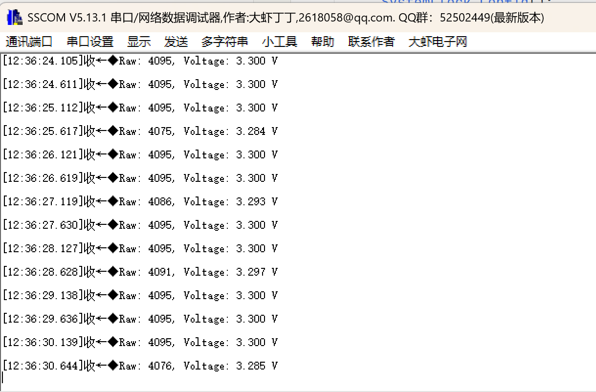
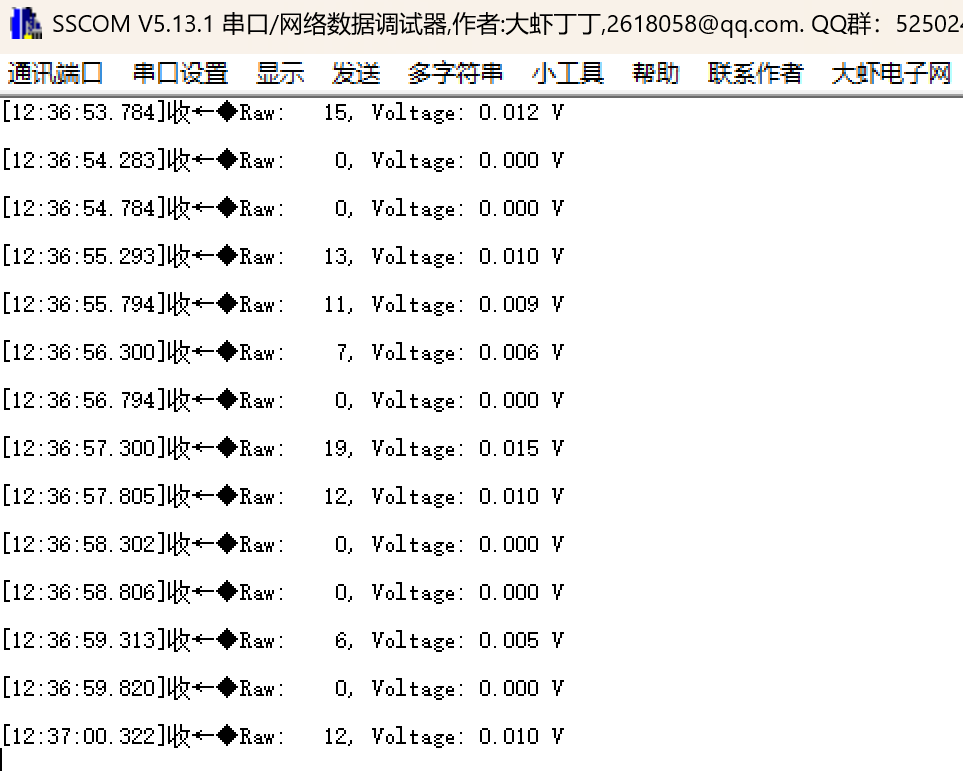

# ADC Poll: ADC单通道轮询采集

## 功能说明

ADC最基础的使用方式：**轮询采集单通道**。

- 采集PA0引脚电压
- 12位分辨率 (0~4095)
- 串口打印结果

## 硬件连接

| 引脚 | 功能 | 连接 |
|------|------|------|
| PA0 | ADC1_IN0 | 接3.3V或GND测试 |
| PA9 | USART1_TX | 串口输出 |
| PA10 | USART1_RX | 串口输入 |

## CubeMX配置

### 1. 新建工程

- MCU: STM32F429IGT6
- 工程名: adcPoll
- Toolchain: MDK-ARM V5

### 2. 时钟配置

```
Clock Configuration:
├── HSE = 25MHz
├── PLL Source = HSE
├── SYSCLK = 180MHz
└── APB2 = 90MHz
```

### 3. ADC1配置

**Pinout: PA0 → ADC1_IN0**

点击PA0，选择 `ADC1_IN0`

**Analog → ADC1:**

```
Mode:
└── IN0: IN0 Single-ended  (或直接勾选IN0)
```

**Parameter Settings → ADC_Settings:**

| 参数 | 值 | 说明 |
|------|-----|------|
| Clock Prescaler | PCLK2 divided by 4 | ADC时钟 = 90/4 = 22MHz |
| Resolution | 12 bits | 0~4095 |
| Scan Conversion Mode | Disabled | 单通道不需要 |
| Continuous Conversion Mode | Disabled | 轮询单次 |
| Discontinuous Conversion Mode | Disabled | |
| DMA Continuous Requests | Disabled | 不用DMA |
| End Of Conversion Selection | EOC flag at the end of single channel conversion | |

**Parameter Settings → ADC_Regular_ConversionMode:**

| 参数 | 值 |
|------|-----|
| Number Of Conversion | 1 |
| External Trigger Conversion Source | Software Trigger (软件触发) |
| Rank 1 → Channel | Channel 0 |
| Rank 1 → Sampling Time | 84 Cycles | 

**采样时间说明:**

```
总转换时间 = 采样时间 + 12个ADC时钟周期

采样时间选项: 3, 15, 28, 56, 84, 112, 144, 480 cycles

84 Cycles时:
转换时间 = (84 + 12) / 22MHz = 4.36μs
```

### 4. USART1配置

**Connectivity → USART1:**

```
Mode: Asynchronous
```

| 参数 | 值 |
|------|-----|
| Baud Rate | 115200 |
| Word Length | 8 Bits |
| Stop Bits | 1 |
| Parity | None |

### 5. 生成代码

- 勾选: Generate peripheral initialization as a pair of .c/.h files
- 点击: GENERATE CODE

## 代码集成

### 1. 添加文件

将 `adc_poll.c` 和 `adc_poll.h` 复制到工程。

### 2. main.c

```c
/* USER CODE BEGIN Includes */
#include "adc_poll.h"
#include <stdio.h>
/* USER CODE END Includes */

/* USER CODE BEGIN 0 */
/* printf重定向 */
int fputc(int ch, FILE *f)
{
    HAL_UART_Transmit(&huart1, (uint8_t *)&ch, 1, 10);
    return ch;
}
/* USER CODE END 0 */

int main(void)
{
    HAL_Init();
    SystemClock_Config();
    MX_GPIO_Init();
    MX_ADC1_Init();
    MX_USART1_UART_Init();
    
    /* USER CODE BEGIN 2 */
    printf("\r\n===== ADC Polling Demo =====\r\n");
    printf("PA0 (ADC1_IN0)\r\n\r\n");
    /* USER CODE END 2 */
    
    while (1)
    {
        /* USER CODE BEGIN 3 */
        ADC_Result_t result;
        
        /* 单次采集 */
        if (ADC_Poll_Read(&hadc1, &result) == HAL_OK) {
            printf("Raw: %4d, Voltage: %.3f V\r\n", 
                   result.raw, result.voltage);
        } else {
            printf("ADC Error!\r\n");
        }
        
        HAL_Delay(500);
        /* USER CODE END 3 */
    }
}
```

### 3. 使用平均滤波

```c
/* 16次采样取平均，更稳定 */
ADC_Result_t result;
if (ADC_Poll_ReadAverage(&hadc1, &result, 16) == HAL_OK) {
    printf("Avg Raw: %4d, Voltage: %.3f V\r\n", 
           result.raw, result.voltage);
}
```

## 预期结果

### PA0接3.3V

```
===== ADC Polling Demo =====
PA0 (ADC1_IN0)

Raw: 4095, Voltage: 3.300 V
Raw: 4095, Voltage: 3.300 V
Raw: 4095, Voltage: 3.300 V
...
```

### PA0接GND

```
Raw:    0, Voltage: 0.000 V
Raw:    0, Voltage: 0.000 V
Raw:    0, Voltage: 0.000 V
...
```

### PA0悬空 (不推荐)

```
Raw: 2048, Voltage: 1.650 V  ← 不稳定，会跳变
Raw: 1876, Voltage: 1.512 V
Raw: 2234, Voltage: 1.801 V
...
```

## 原理图解

### ADC转换流程

```
       PA0引脚
          │
          ↓
    ┌──────────┐
    │ 采样保持 │ ← 采样时间 (84 cycles)
    └────┬─────┘
         ↓
    ┌──────────┐
    │ 12位SAR  │ ← 逐次逼近 (12 cycles)
    └────┬─────┘
         ↓
      数据寄存器 (0~4095)
```

### 轮询流程

```
   HAL_ADC_Start()
         │
         ↓
   ┌───────────┐
   │ 等待EOC=1 │ ← PollForConversion()
   └─────┬─────┘
         │ (转换完成)
         ↓
   HAL_ADC_GetValue()
         │
         ↓
   HAL_ADC_Stop()
```

## 常见问题

**Q: 读出来一直是0?**

A: 检查:
1. PA0是否配置为ADC功能
2. ADC时钟是否使能
3. 引脚是否真的接了电压

**Q: 读出来一直是4095?**

A: 
1. 输入电压超过3.3V
2. 内部上拉导致

**Q: 数值跳动大?**

A:
1. 引脚悬空，加上拉/下拉
2. 增加采样时间
3. 使用平均滤波

**Q: 电压计算不准?**

A: 
1. 确认参考电压VREF是否准确是3.3V
2. 开发板上VREF可能有偏差

## 文件结构

```
04_adc_polling/
├── Core/
│   ├── Inc/
│   │   └── adc_poll.h
│   └── Src/
│       └── adc_poll.c
└── README.md
```

## 实验现象

### PA0接3.3V



### PA0接GND

