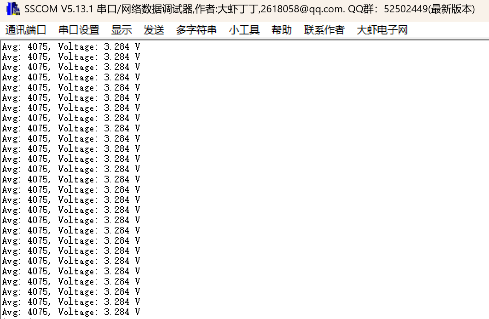
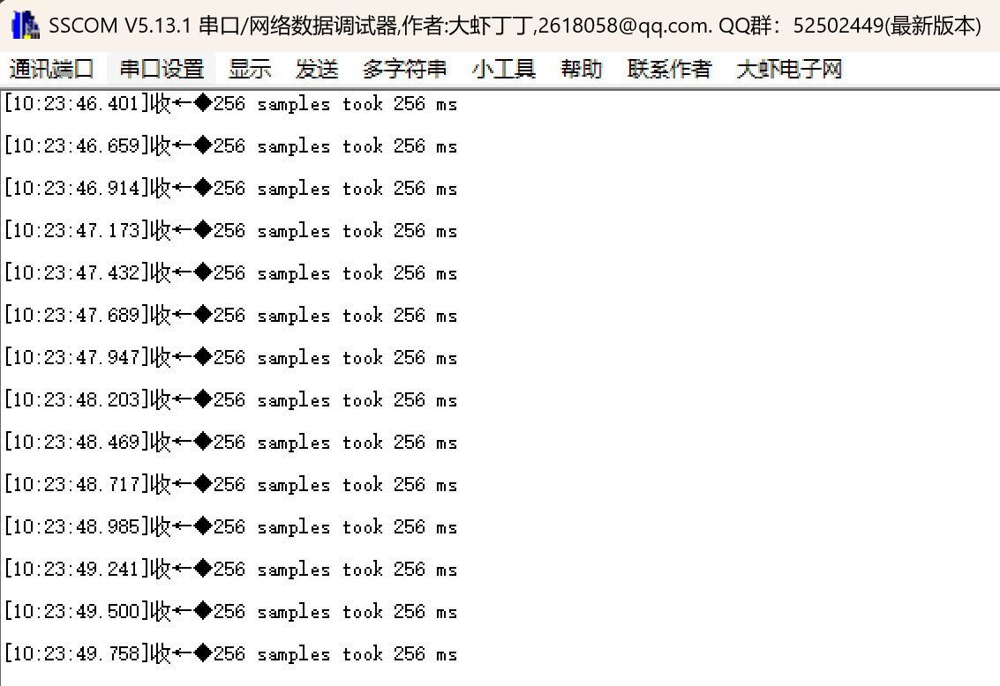

# adcTimerTrigger: 定时器触发ADC - 精确采样率

## 功能说明

使用定时器触发ADC转换，实现**精确、稳定的采样率**。

硬件自动触发，CPU不参与，采样间隔零抖动。

## 为什么需要定时器触发？

### 软件触发的问题

```c
while (1) {
    HAL_ADC_Start(&hadc1);
    HAL_ADC_PollForConversion(&hadc1, 100);
    value = HAL_ADC_GetValue(&hadc1);
    HAL_Delay(1);  // 目标：1kHz采样
}
```

**实际采样间隔：**
```
= ADC转换时间 + 代码执行时间 + HAL_Delay + 中断响应
= 4μs + ~10μs + 1ms + 抖动
≈ 1.01~1.03ms (不精确!)
```

### 定时器触发的优势

```
TIM3: ─────┬─────────┬─────────┬─────────┬─────
           │ 1.000ms │ 1.000ms │ 1.000ms │
           ↓         ↓         ↓         ↓
ADC:      [转换]    [转换]    [转换]    [转换]
           │         │         │         │
DMA:       └→Buffer[0]→Buffer[1]→Buffer[2]→...

精确1kHz，硬件保证，与CPU无关！
```

## 应用场景

| 场景 | 采样率 | 说明 |
|------|--------|------|
| 音频采集 | 44.1kHz | 必须精确，否则音调失真 |
| 电力测量 | 10kHz | 分析50Hz波形 |
| 振动分析 | 25.6kHz | FFT要求等间隔采样 |
| 心电图ECG | 500Hz | 医疗级精度要求 |

## 系统框图

```
┌─────────────────────────────────────────────────────────────┐
│                                                             │
│    TIM3                    ADC1                    DMA      │
│   ┌─────┐                ┌─────┐                ┌─────┐     │
│   │     │    TRGO        │     │    Request     │     │     │
│   │ ARR ├───────────────→│触发 ├───────────────→│搬运  │     │
│   │     │  (更新事件)    │     │  (转换完成)     │      │    │
│   └──┬──┘                └──┬──┘                └──┬──┘     │
│      │                      │                      │        │
│      │                      │                      ↓        │
│   ┌──┴──┐                ┌──┴──┐              ┌───────┐     │
│   │1kHz │                │PA0  │              │Buffer │     │
│   │溢出 │                │输入  │              │[256]  │    │
│   └─────┘                └─────┘              └───────┘     │
│                                                    │        │
│                                             CPU读取↓        │
└─────────────────────────────────────────────────────────────┘
```

## 硬件连接

| 引脚 | 功能 | 连接 |
|------|------|------|
| PA0 | ADC1_IN0 | 被测信号/接3.3V测试 |
| PA9 | USART1_TX | 串口输出 |

## CubeMX配置

### 1. TIM3配置 (触发源)

**Timers → TIM3:**

```
Mode:
└── Clock Source: Internal Clock
```

**Parameter Settings:**

| 参数 | 值 | 说明 |
|------|-----|------|
| Prescaler | 89 | 89MHz/(89+1) = 1MHz |
| Counter Period | 999 | 1MHz/1000 = 1kHz触发 |
| auto-reload preload | Enable | |

**Trigger Output (TRGO):**

| 参数 | 值 | 说明 |
|------|-----|------|
| **Trigger Event Selection** | **Update Event** | **关键！溢出时触发** |

### 2. ADC1配置

**Analog → ADC1:**

```
Mode:
└── IN0: IN0 Single-ended
```

**Parameter Settings:**

| 参数 | 值 | 说明 |
|------|-----|------|
| Clock Prescaler | PCLK2 divided by 4 | |
| Resolution | 12 bits | |
| Scan Conversion Mode | Disabled | |
| **Continuous Conversion Mode** | **Disabled** | **关键！每次触发转换一次** |
| DMA Continuous Requests | Enabled | |
| End Of Conversion Selection | EOC flag at the end of single channel conversion | |

**ADC_Regular_ConversionMode:**

| 参数 | 值 | 说明 |
|------|-----|------|
| Number Of Conversion | 1 | |
| **External Trigger Conversion Source** | **Timer 3 Trigger Out event** | **关键！选TIM3** |
| **External Trigger Conversion Edge** | **Trigger detection on the rising edge** | **关键！上升沿触发** |
| Rank 1 Channel | Channel 0 | |
| Rank 1 Sampling Time | 84 Cycles | |

### 3. DMA配置

**ADC1 → DMA Settings → Add:**

| 参数 | 值 |
|------|-----|
| DMA Request | ADC1 |
| Stream | DMA2 Stream 0 |
| Direction | Peripheral To Memory |
| Mode | Circular |
| Memory Increment | Enabled |
| Data Width | Half Word |

### 4. NVIC配置

| 中断 | 使能 |
|------|------|
| DMA2 Stream0 global interrupt | ✓ |

### 5. 配置示意图

```
┌─────────────────────────────────────────────────────┐
│                  CubeMX 配置要点                     │
├─────────────────────────────────────────────────────┤
│                                                     │
│  TIM3:                                              │
│  ├── Prescaler: 89                                  │
│  ├── Period: 999            → 1kHz触发频率           │
│  └── TRGO: Update Event     ← 关键！                 │
│                                                     │
│  ADC1:                                              │
│  ├── Continuous: Disabled   ← 关键！不是连续模式      │
│  ├── External Trigger Source: Timer 3 Trigger Out   │
│  └── External Trigger Edge: Rising edge             │ 
│                                                     │
│  DMA: Circular, Memory Increment                    │
│                                                     │
└─────────────────────────────────────────────────────┘
```

## 代码使用

### main.c

```c
/* USER CODE BEGIN Includes */
#include "adc_timer_trigger.h"
#include <stdio.h>
/* USER CODE END Includes */

/* USER CODE BEGIN 0 */
int fputc(int ch, FILE *f)
{
    HAL_UART_Transmit(&huart1, (uint8_t *)&ch, 1, 10);
    return ch;
}
/* USER CODE END 0 */

int main(void)
{
    HAL_Init();
    SystemClock_Config();
    MX_GPIO_Init();
    MX_DMA_Init();
    MX_ADC1_Init();
    MX_TIM3_Init();
    MX_USART1_UART_Init();
    
    /* USER CODE BEGIN 2 */
    ADC_TT_Init(&hadc1, &htim3);
    ADC_TT_Start();
    /* USER CODE END 2 */
    
    while (1)
    {
        /* USER CODE BEGIN 3 */
        
        if (ADC_TT_IsDataReady()) {
            /* 256个采样点完成，耗时正好256ms */
            uint16_t avg = ADC_TT_GetAverage();
            float voltage = ADC_TT_GetVoltage();
            
            printf("Avg: %4d, Voltage: %.3f V\r\n", avg, voltage);
        }
        
        /* USER CODE END 3 */
    }
}
```

### 修改采样率

```c
/* 在Start之前调用 */
/* TIM3时钟 = APB1 Timer = 90MHz */

ADC_TT_SetSampleRate(1000, 90000000);    // 1kHz
ADC_TT_SetSampleRate(10000, 90000000);   // 10kHz
ADC_TT_SetSampleRate(44100, 90000000);   // 44.1kHz (音频)
```

## 预期结果

```
===== ADC Timer Trigger Demo =====
Sample Rate: 1kHz, Buffer: 256 samples
Buffer fills in: 256ms

Avg: 4088, Voltage: 3.294 V
Avg: 4089, Voltage: 3.295 V
Avg: 4087, Voltage: 3.294 V
...
```

每256ms输出一次（256样本 ÷ 1kHz = 256ms）。

## 验证采样率

### 方法1：测量缓冲区填充时间

```c
uint32_t start = HAL_GetTick();
ADC_TT_Start();
while (!ADC_TT_IsDataReady());
uint32_t elapsed = HAL_GetTick() - start;

printf("256 samples took %lu ms\r\n", elapsed);
// 1kHz采样率应该是 256ms
```

### 方法2：示波器测量

在ADC回调里翻转GPIO：

```c
void HAL_ADC_ConvCpltCallback(ADC_HandleTypeDef *hadc)
{
    HAL_GPIO_TogglePin(GPIOB, GPIO_PIN_0);  // 每次DMA完成翻转
    s_data_ready = true;
}
```

示波器测量GPIO周期 = 256ms (1kHz × 256样本)

## 常见问题

**Q: ADC不转换？**

A: 检查：
1. TIM3 TRGO 是否配置为 Update Event
2. ADC External Trigger Source 是否选择 Timer 3
3. ADC External Trigger Edge 是否选择 Rising edge
4. TIM3 是否启动 (HAL_TIM_Base_Start)

**Q: 采样率不对？**

A: 检查TIM3的PSC和ARR配置：
```
采样率 = TIM_CLK / (PSC+1) / (ARR+1)
```

**Q: Continuous模式要Disabled?**

A: 是的！
- Continuous=Enabled: ADC不停转换，忽略外部触发
- Continuous=Disabled: ADC等待触发信号才转换

**Q: 可以用其他定时器吗？**

A: 可以，但要选对触发源：

| 定时器 | ADC Trigger Source |
|--------|-------------------|
| TIM1 | Timer 1 Trigger Out event |
| TIM2 | Timer 2 Trigger Out event |
| TIM3 | Timer 3 Trigger Out event |
| TIM4 | Timer 4 Trigger Out event |
| TIM8 | Timer 8 Trigger Out event |

## 定时器触发 vs 软件触发 vs 连续模式

| 特性 | 软件触发 | 连续模式 | 定时器触发 |
|------|---------|---------|-----------|
| 采样率精度 | 低 | 取决于ADC时钟 | **高** |
| 采样率控制 | 软件延时 | 固定 | **灵活可调** |
| CPU占用 | 高 | 低 | **低** |
| 典型应用 | 偶尔读取 | 最大速度采集 | **信号采集/分析** |

## 文件结构

```
adcTimerTrigger/
├── Core/
│   ├── Inc/
│   │   └── adc_timer_trigger.h
│   └── Src/
│       └── adc_timer_trigger.c
└── README.md
```

## 实验效果

### 1. 采样数据



### 2. 采样频率
256个采样点，耗时256ms，每256ms输出一次。

