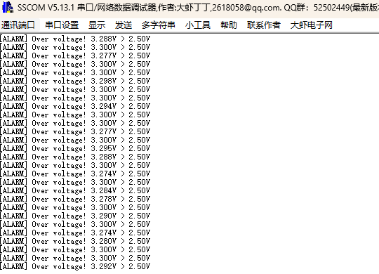

# adcWatchdog: ADC模拟看门狗 - 电压超限自动报警

## 功能说明

模拟看门狗(Analog Watchdog, AWD)监测ADC转换值，当**超出设定阈值**时自动触发中断。

硬件自动比较，无需软件轮询，响应速度快。

## 工作原理

```
        ADC转换值
            │
  ┌─────────┼─────────┐
  │         │         │
  │    High Threshold │ ← 上限 (HTR寄存器)
  │  ───────┼───────  │
  │         │         │
  │     正常范围       │ ← 不报警
  │         │         │
  │  ───────┼───────  │
  │    Low Threshold  │ ← 下限 (LTR寄存器)
  │         │         │
  └─────────┼─────────┘
            │
     超出范围 → AWD中断触发!
```

## 应用场景

| 场景 | 说明 |
|------|------|
| 过压保护 | 电源电压 > 阈值时报警 |
| 欠压保护 | 电池电压 < 阈值时报警 |
| 温度监测 | NTC热敏电阻超温报警 |
| 电流监测 | 采样电阻压降超限报警 |

## 硬件连接

| 引脚 | 功能 | 连接 |
|------|------|------|
| PA0 | ADC1_IN0 | 被监测信号 (用电位器测试) |
| PA9 | USART1_TX | 串口输出 |

**测试方法：** 用电位器连接PA0，旋转电位器改变电压，观察报警触发。

## CubeMX配置

### 1. ADC1基本配置

**Pinout: PA0 → ADC1_IN0**

**Analog → ADC1 → Parameter Settings:**

| 参数 | 值 | 说明 |
|------|-----|------|
| Clock Prescaler | PCLK2 divided by 4 | |
| Resolution | 12 bits | |
| Scan Conversion Mode | Disabled | |
| **Continuous Conversion Mode** | **Enabled** | **必须开启！** |
| DMA Continuous Requests | Disabled | |

> ⚠️ **重要**：必须开启 Continuous Conversion Mode！
>
> AWD只在ADC转换时检查阈值。如果是单次转换模式，ADC转换一次就停止，AWD也只能触发一次。

### 2. 规则通道配置

**ADC_Regular_ConversionMode:**

| 参数 | 值 |
|------|-----|
| Number Of Conversion | 1 |
| External Trigger | Software Trigger |
| Rank 1 Channel | Channel 0 |
| Rank 1 Sampling Time | 84 Cycles |

### 3. 模拟看门狗配置 (关键!)

**ADC_Analog_WatchDog:**

| 参数 | 值 | 说明 |
|------|-----|------|
| **Analog Watchdog Mode** | **Analog watchdog on single regular channel** | 单通道监测 |
| **Analog watchdog channel selection** | **Channel 0** | 监测IN0 |
| **Enable Analog watchdog interrupt** | **ENABLE** | 使能中断 |
| **Watchdog high threshold** | **3000** | 上限 (~2.42V) |
| **Watchdog low threshold** | **1000** | 下限 (~0.81V) |

### 4. NVIC配置

| 中断 | 使能 |
|------|------|
| ADC1, ADC2 and ADC3 global interrupts | ✓ |

### 5. 配置示意图

```
┌─────────────────────────────────────────────────────┐
│                    ADC1 配置                        │
├─────────────────────────────────────────────────────┤
│                                                     │
│  Basic:                                             │
│  ├── Continuous: Enabled     ← 必须开启！            │
│  └── Channel: IN0 (PA0)                             │
│                                                     │
│  Analog Watchdog:                                   │
│  ├── Mode: Single regular channel                   │
│  ├── Channel: Channel 0                             │
│  ├── Interrupt: ENABLE                              │
│  ├── High Threshold: 3000     (约2.42V)             │
│  └── Low Threshold: 1000      (约0.81V)             │
│                                                     │
│  NVIC:                                              │
│  └── ADC global interrupt: Enabled                  │
│                                                     │
└─────────────────────────────────────────────────────┘
```

## 代码使用

### main.c

```c
/* USER CODE BEGIN Includes */
#include "adc_watchdog.h"
#include <stdio.h>
/* USER CODE END Includes */

/* USER CODE BEGIN 0 */
int fputc(int ch, FILE *f)
{
    HAL_UART_Transmit(&huart1, (uint8_t *)&ch, 1, 10);
    return ch;
}
/* USER CODE END 0 */

int main(void)
{
    HAL_Init();
    SystemClock_Config();
    MX_GPIO_Init();
    MX_ADC1_Init();
    MX_USART1_UART_Init();

    /* USER CODE BEGIN 2 */
    AWD_Init(&hadc1);

    /* 设置监测范围: 1.0V ~ 2.5V */
    AWD_SetThreshold(1.0f, 2.5f);

    AWD_Status_t status;
    AWD_GetStatus(&status);
    printf("Threshold: %.2fV ~ %.2fV\r\n",
           status.low_voltage, status.high_voltage);
    printf("Rotate potentiometer to test...\r\n\r\n");

    AWD_Start();
    /* USER CODE END 2 */

    while (1)
    {
        /* USER CODE BEGIN 3 */

        /* 检查报警 */
        if (AWD_IsAlarm()) {
            AWD_AlarmType_t type = AWD_GetAlarmType();
            float voltage = AWD_GetCurrentVoltage();

            if (type == AWD_ALARM_HIGH) {
                printf("[ALARM] Over voltage! %.3fV > %.2fV\r\n",
                       voltage, status.high_voltage);
            } else if (type == AWD_ALARM_LOW) {
                printf("[ALARM] Under voltage! %.3fV < %.2fV\r\n",
                       voltage, status.low_voltage);
            }
        }

        /* 定期显示当前电压 */
        static uint32_t last_print = 0;
        if (HAL_GetTick() - last_print > 500) {
            last_print = HAL_GetTick();
            printf("Current: %.3fV (count=%lu)\r\n",
                   AWD_GetCurrentVoltage(),
                   status.alarm_count);
            AWD_GetStatus(&status);
        }

        /* USER CODE END 3 */
    }
}
```

## 预期结果

```
Threshold: 1.00V ~ 2.50V
Rotate potentiometer to test...

Current: 1.650V (count=0)
Current: 1.720V (count=0)
Current: 2.100V (count=0)
Current: 2.480V (count=0)
[ALARM] Over voltage! 2.520V > 2.50V
Current: 2.650V (count=1)
[ALARM] Over voltage! 2.680V > 2.50V
Current: 2.700V (count=2)
Current: 2.300V (count=2)      ← 回到正常范围
Current: 1.200V (count=2)
Current: 0.900V (count=2)
[ALARM] Under voltage! 0.850V < 1.00V
Current: 0.750V (count=3)
...
```

## 阈值计算

```
原始值 = 电压 × 4095 ÷ 3.3V

例如:
- 1.0V → 1241
- 2.5V → 3103

电压 = 原始值 × 3.3V ÷ 4095

例如:
- 1000 → 0.806V
- 3000 → 2.418V
```

## 看门狗模式

STM32支持三种监测模式：

| 模式 | 说明 |
|------|------|
| **Single regular channel** | 监测单个规则通道 |
| **All regular channels** | 监测所有规则通道 |
| **Single injected channel** | 监测单个注入通道 |

本DEMO使用Single regular channel模式。

## 动态修改阈值

```c
/* 运行时修改阈值 */
AWD_SetThreshold(0.5f, 3.0f);  // 新范围: 0.5V ~ 3.0V

/* 或者用原始值 */
AWD_SetThresholdRaw(500, 3500);
```

## 常见问题

**Q: 看门狗中断不触发？**

A: 检查：
1. CubeMX中 "Enable Analog watchdog interrupt" 是否设为 ENABLE
2. ADC全局中断是否使能
3. 阈值设置是否正确（High > Low）
4. 是否调用了 `AWD_Start()`

**Q: 看门狗只触发一次？**

A: 检查 **Continuous Conversion Mode** 是否开启！

```
单次转换模式 (Continuous = Disabled):
ADC: [转换] → 停止
        ↓
      AWD检查 → 只触发一次，因为ADC停了

连续转换模式 (Continuous = Enabled):
ADC: [转换] → [转换] → [转换] → ...
        ↓        ↓        ↓
      AWD检查  AWD检查  AWD检查 → 持续监测
```

AWD只在ADC转换完成时检查阈值，ADC不转换就没机会检查。

**Q: 报警太频繁？**

A: 如果信号有噪声，会反复触发。解决方案：
1. 硬件滤波（加电容）
2. 软件去抖（连续N次超限才报警）
3. 适当放宽阈值范围

**Q: 如何同时监测多个通道？**

A: 选择 "All regular channels" 模式，但此时无法区分是哪个通道超限

**Q: 回调函数名是什么？**

A: `HAL_ADC_LevelOutOfWindowCallback()`，不是ConvCpltCallback

## 与软件比较的对比

| 方式 | 优点 | 缺点 |
|------|------|------|
| **模拟看门狗** | 硬件自动，零CPU负担，响应快 | 只能设置一组阈值 |
| **软件比较** | 灵活，可设置多组阈值 | 需要CPU参与，有延迟 |

## 文件结构

```
adc_watchdog/
├── Core/
│   ├── Inc/
│   │   └── adc_watchdog.h
│   └── Src/
│       └── adc_watchdog.c
└── README.md
```

## 实验效果


