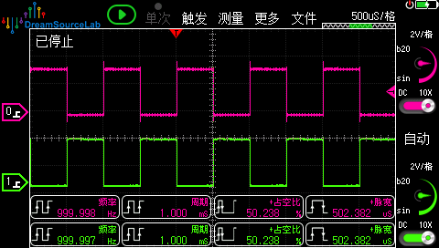
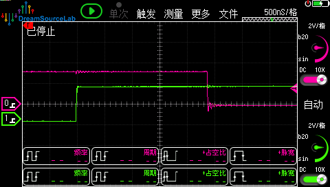
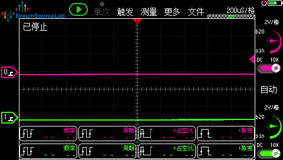

# TIM8 PWM互补输出 + 死区 + 刹车 演示工程

## 1. 硬件平台

**MCU:** STM32F407IGT6  
**开发环境:** CubeMX 6.15.0 + Keil MDK V5.26

## 2. 引脚分配

| 引脚 | 功能 | 连接 |
|------|------|------|
| PI5 | TIM8_CH1 | 示波器CH1 (PWM输出) |
| PH13 | TIM8_CH1N | 示波器CH2 (互补输出) |
| PA6 | TIM8_BKIN | 刹车输入 (低电平触发) |
| PE0 | GPIO_Output | 运行指示灯|
## 3. 功能说明

- PWM频率: 1kHz
- 死区时间: 约2.38μs
- 刹车极性: 低电平有效
- 刹车恢复: 自动恢复 (AOE=1)

## 4. CubeMX配置

### 4.1 时钟配置
- HSE -> PLL -> SYSCLK = 168MHz
- APB2 Timer clocks = 168MHz

### 4.2 TIM8配置

**Timers -> TIM8:**
- Clock Source: Internal Clock
- Channel1: PWM Generation CH1 CH1N

**Parameter Settings:**
| 参数 | 值 |
|------|-----|
| Prescaler | 167 |
| Counter Period | 999 |
| Pulse (CH1) | 500 |
| Internal Clock Division | 4 |

**Break And Dead Time:**
| 参数 | 值 |
|------|-----|
| Dead Time | 100 |
| Break State | Enable |
| Break Polarity | Low |
| Automatic Output | Enable |

### 4.3 GPIO (自动配置)
- PI5: AF3 (TIM8_CH1)
- PH13: AF3 (TIM8_CH1N)
- PA6: AF3 (TIM8_BKIN)

## 5. 示波器测试

### 5.1 观察互补输出
- 时基: 200μs/div
- 应看到CH1和CH2相位相反

### 5.2 观察死区
- 时基: 500ns/div
- 放大CH1下降沿区域
- 应看到约2.38μs的死区间隙

### 5.3 测试刹车
- 将PA6接到GND
- 两个通道同时变为低电平
- 断开后自动恢复PWM输出

## 6. 死区计算

详情见[《STM32定时器死区时间如何计算.pdf》](./Doc/STM32定时器死区时间如何计算.pdf)

## 7. 运行结果

### 7.1 互补输出

### 7.2 死区时间

### 7.3 刹车效果
