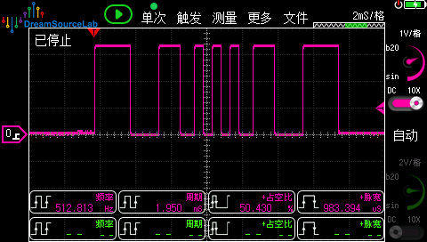
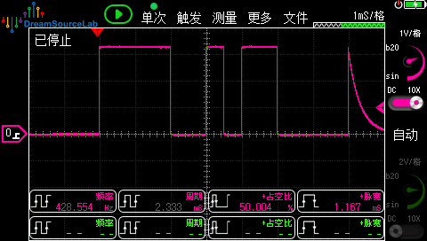

# OutputCompare: 输出比较 - 不等间隔脉冲

## 为什么需要输出比较？

**PWM的局限**：每个周期间隔完全相同，无法改变

```
PWM输出:
┌─┐ ┌─┐ ┌─┐ ┌─┐ ┌─┐ ┌─┐
┘ └─┘ └─┘ └─┘ └─┘ └─┘ └
  │←→│←→│←→│  每个间隔都一样
```

**输出比较能做到**：每次翻转间隔可以不同

```
输出比较 (本DEMO):
┌─┐   ┌─┐ ┌┐┌┐ ┌─┐   ┌─┐
┘ └───┘ └─┘└┘└─┘ └───┘ └
  │长│ │中│短│短│中│ │长│  间隔变化！
  
  加速    匀速    减速
```

## 应用场景

| 场景 | 为什么需要不等间隔 |
|------|-------------------|
| 步进电机加减速 | 启动时脉冲慢，运行时脉冲快，停止前脉冲慢 |
| 红外遥控编码 | 不同bit宽度不同 (NEC: 引导9ms, 数据0.56ms/1.68ms) |
| 舵机控制序列 | 平滑过渡到目标位置 |
| 音乐蜂鸣器 | 不同音符频率不同 |

## 本DEMO演示

**步进电机梯形加减速曲线**：

```
脉冲间隔(ms)
    ↑
  2 │■                        ■
    │  ■                    ■
1.2 │    ■                ■
    │      ■            ■
0.5 │        ■ ■ ■ ■ ■
    └────────────────────────→ 脉冲序号
        加速   匀速   减速
```

## CubeMX配置

### TIM3配置

```
Mode:
├── Clock Source: Internal Clock
└── Channel1: Output Compare CH1
```

**Counter Settings:**

| 参数 | 值 | 说明 |
|------|-----|------|
| Prescaler | 89 | 1MHz计数 |
| Counter Period | 65535 | 自由运行 |

**Output Compare Channel 1:**

| 参数 | 值 |
|------|-----|
| Mode | Toggle on match |
| Pulse | 0 |

**NVIC:**

| 中断 | 使能 |
|------|------|
| TIM1 capture compare interrupt | ✓ |

## 代码使用

### main.c

```c
/* USER CODE BEGIN Includes */
#include "output_compare.h"
/* USER CODE END Includes */

/* USER CODE BEGIN 2 */
OC_Init(&htim3, TIM_CHANNEL_1);
/* USER CODE END 2 */

/* USER CODE BEGIN WHILE */
while (1)
{
    /* 执行加减速演示 */
    OC_Demo_StepperAccel();
    
    /* 等待完成 */
    while (!OC_IsFinished()) {
        // 可以做其他事情
    }
    
    HAL_Delay(1000);  /* 间隔1秒再执行 */
    
    /* USER CODE END WHILE */
}
```

### 自定义脉冲序列

```c
/* 自定义间隔 (单位: 计数值, 1MHz下1000=1ms) */
uint32_t my_intervals[] = {
    1000,   /* 1ms */
    500,    /* 0.5ms */
    500,
    2000,   /* 2ms */
    100,    /* 0.1ms */
};

OC_Demo_CustomPulse(my_intervals, 5);
```

## 原理详解

### PWM为什么做不到？

```
PWM硬件逻辑:
CNT: 0 → ARR → 0 → ARR → 0 → ...  (固定周期循环)
     ↓       ↓       ↓
输出: 由CNT和CCR比较决定电平

周期 = ARR，无法在运行中每个周期改变
```

### 输出比较如何实现？

```
输出比较 (Toggle模式):

CNT:    0 ──→ 500 ──→ 1000 ──→ 1200 ──→ ...
               ↓        ↓        ↓
             匹配      匹配      匹配
             翻转      翻转      翻转
              │        │         │
         中断设置   中断设置   中断设置
        CCR=1000   CCR=1200   CCR=1500
              │        │         │
              ↓        ↓         ↓
           间隔500  间隔200   间隔300  ← 每次不同！
```

关键：**每次匹配触发中断，在中断里设置下一个CCR值**

### 代码核心

```c
void HAL_TIM_OC_DelayElapsedCallback(TIM_HandleTypeDef *htim)
{
    // 获取当前CCR
    uint32_t current_ccr = __HAL_TIM_GET_COMPARE(htim, channel);
    
    // 设置下一个间隔 (可以是任意值！)
    uint32_t next_interval = s_intervals[s_current_index++];
    
    // 更新CCR
    __HAL_TIM_SET_COMPARE(htim, channel, current_ccr + next_interval);
}
```

## 示波器观察

连接PA6到示波器，执行 `OC_Demo_StepperAccel()` 后应该看到：

```
     2ms    1.6ms  1.2ms 0.8ms      0.8ms 1.2ms  1.6ms   2ms
    ┌──┐   ┌──┐   ┌─┐   ┌┐ ┌┐ ┌┐ ┌┐ ┌─┐   ┌──┐   ┌──┐
────┘  └───┘  └───┘ └───┘└─┘└─┘└─┘└─┘ └───┘  └───┘  └────

    ←─── 加速 ───→←─ 匀速 ─→←─── 减速 ───→
    间隔越来越短    间隔最短    间隔越来越长
```

## 与PWM模式对比总结

| 特性 | PWM | 输出比较 |
|------|-----|---------|
| 间隔 | 固定 | **每次可变** |
| 中断 | 通常不需要 | 必须用中断更新CCR |
| CPU负担 | 几乎为0 | 每个脉冲一次中断 |
| 适用 | 固定频率/占空比 | **变频率、不规则时序** |

## 文件结构

```
02_output_compare/
├── Core/
│   ├── Inc/
│   │   └── output_compare.h
│   └── Src/
│       └── output_compare.c
└── README.md
```

## 输出比较所有模式

| 模式 | CNT=CCR时动作 | 用途 |
|------|-----|---------|
| Frozen | 输出不变 | 纯定时，只触发中断/DMA |
| Active Level on match | 输出置高| 定时后输出高电平 |
| Inactive Level on match | 输出置低 | 定时后输出低电平 |
| Toggle on match | 输出翻转 | 产生方波 |
| Forced Active | 强制输出高 | 调试/强制状态 |
| Forced Inactive | 强制输出低 | 调试/强制状态 |

```
CNT:  0 ────────→ CCR ────────→ ARR → 0 ────→ CCR
                   ↓                           ↓
                 匹配                         匹配

Frozen:           (无变化，只触发中断)
输出: ─────────────────────────────────────────

Active on match:  (匹配时置高)
输出: ─────────────┌───────────────────────────

Inactive on match:(匹配时置低)
输出: ─────────────┐___________________________

Toggle on match:  (匹配时翻转)
输出: ─────────────┘___________┌───────────────

Forced Active:    (无视CNT，强制高)
输出: ┌────────────────────────────────────────

Forced Inactive:  (无视CNT，强制低)
输出: ─────────────────────────────────────────
```
## 本DEMO实验现象
- **步进电机加减速**  


- **自定义脉冲序列**  
