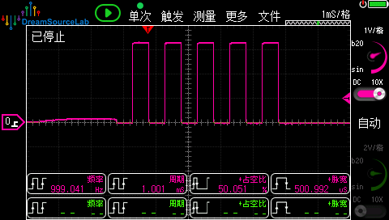
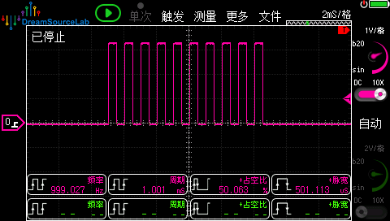

# PulseOutput: 高级定时器输出固定脉冲数

## 功能说明

利用高级定时器(TIM1/TIM8)的 **RCR + OPM** 功能，输出精确数量的PWM脉冲。

**核心优势：纯硬件实现，零CPU占用。**

## 应用场景

| 场景 | 说明 |
|------|------|
| 步进电机控制 | 输出N个脉冲 = 电机转N步 |
| 舵机定位 | 发送固定数量控制脉冲 |
| 通信触发 | 精确数量的触发信号 |
| 激光打标 | 控制激光点数 |

## 原理详解

### 普通定时器 vs 高级定时器

```
普通定时器 (TIM2/3/4...):
CNT: 0→ARR→0→ARR→0→ARR→0→ARR
          ↑     ↑     ↑     ↑
         UEV   UEV   UEV   UEV   每个周期都更新


高级定时器 (TIM1/TIM8) 设置 RCR=3:
CNT: 0→ARR→0→ARR→0→ARR→0→ARR
     [  1  ][  2  ][  3  ][  4  ]
                              ↑
                            UEV   4个周期后才更新！
                            
RCR = N 表示 N+1 个周期后触发更新事件
```

### RCR + OPM 组合

```
RCR=4, OPM=1 (单脉冲模式):

     ┌──┐  ┌──┐  ┌──┐  ┌──┐  ┌──┐
─────┘  └──┘  └──┘  └──┘  └──┘  └────── 自动停止！
      1     2     3     4     5
                              ↑
                         第5个周期
                         ↓
                    产生UEV更新事件
                         ↓
                    OPM清除CEN位
                         ↓
                    定时器停止
```

### 关键寄存器

| 寄存器 | 位 | 功能 |
|--------|-----|------|
| CR1 | CEN | 计数器使能，OPM完成后自动清零 |
| CR1 | OPM | 单脉冲模式，UEV后停止 |
| RCR | [7:0] | 重复计数器，0~255 对应 1~256个脉冲 |

## 硬件连接

| 引脚 | 功能 | 说明 |
|------|------|------|
| PC6 | TIM8_CH1 | PWM输出 → 示波器 |

## CubeMX配置

### 1. 时钟配置

```
SYSCLK = 180MHz
APB2 Timer = 180MHz
```

### 2. TIM1配置

**Pinout & Configuration → Timers → TIM8**

```
Mode:
├── Clock Source: Internal Clock
└── Channel1: PWM Generation CH1
```

**Counter Settings:**

| 参数 | 值 | 说明 |
|------|-----|------|
| Prescaler | 179 | 179MHz/(179+1) = 1MHz |
| Counter Period | 999 | 1MHz/1000 = 1kHz PWM |
| Repetition Counter | 0 | 代码动态设置 |
| auto-reload preload | Enable | 推荐使能 |

**PWM Generation Channel 1:**

| 参数 | 值 |
|------|-----|
| Mode | PWM mode 1 |
| Pulse | 500 |
| CH Polarity | High |

### 3. 不需要配置中断

此方案是**纯硬件实现**，不需要任何中断。


## 示波器验证

### 预期波形

```
    5个脉冲              10个脉冲
   ┌┐┌┐┌┐┌┐┌┐          ┌┐┌┐┌┐┌┐┌┐┌┐┌┐┌┐┌┐┌┐
───┘└┘└┘└┘└┘└──────────┘└┘└┘└┘└┘└┘└┘└┘└┘└┘└───
   │← 5ms →│          │←────── 10ms ───────→│
            │← 500ms →│
```

### 如何数脉冲

1. 示波器设置 **单次触发**
2. 时基调到能看清所有脉冲
3. 手动数脉冲数量确认

## 与软件计数方案对比

| 特性 | 本方案 (RCR+OPM) | 软件计数 |
|------|-----------------|---------|
| CPU占用 | **零** | 每脉冲一次中断 |
| 精度 | **硬件精确** | 受中断延迟影响 |
| 最大脉冲数 | 256 (可分批) | 无限制 |
| 适用定时器 | TIM1/TIM8 | 所有定时器 |
| 代码复杂度 | 简单 | 需中断回调 |

## 注意事项

### 1. 超过256个脉冲

RCR是8位寄存器，最大255，对应256个脉冲。超过需要分批：

```c
void Pulse_StartLong(TIM_HandleTypeDef *htim, uint32_t Channel, uint32_t num)
{
    while (num > 0) {
        uint8_t batch = (num > 256) ? 256 : num;
        Pulse_Start(htim, Channel, batch);
        while (!Pulse_IsFinished(htim));
        num -= batch;
    }
}
```

### 2. 仅高级定时器支持

普通定时器(TIM2/3/4等)没有RCR寄存器，只能用软件计数方式。

## 实验现象  
- **初始化输出5个脉冲：**  


- **主循环输出10个脉冲：**  
  