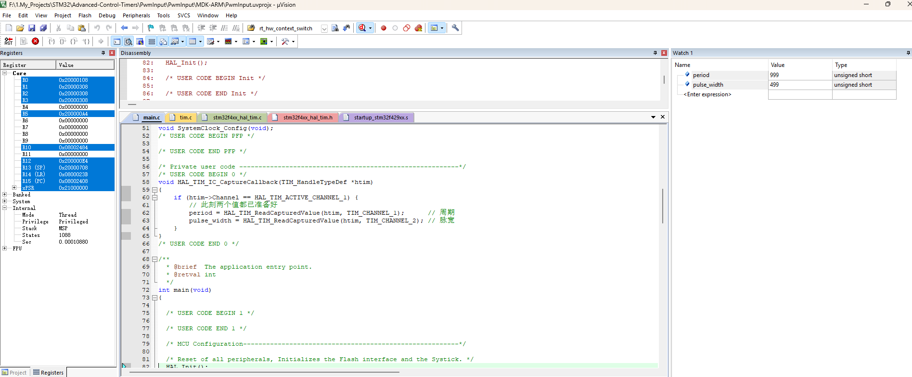

# PWM输入模式 演示工程

## 1. 硬件平台

**MCU:** STM32F429IGT6  
**开发环境:** CubeMX 6.15.0 + Keil MDK V5.26

## 2. 引脚分配

| 引脚 | 功能 | 备注 |
|------|------|------|
| PD12 | TIM4_CH1 | 捕获通道|
| PA8 | TIM3_CH1 | PWM输出 |

## 3. 功能说明

本例程演示了STM32F429IGT6开发板上的TIM3定时器配置为PWM输出模式，输出1KHz的占空比50%的方波。使用TIM4捕获TIM3输入的PWM信号(杜邦线相连)，利用PWM输入模式占用两个捕获通道，将TI1FP1作为触发输入源，TI1FP1这一路采集的数值就是输入信号的周期，TI21FP2这一路采集的数值就是输入信号的占空比。

## 4. CubeMX配置

详情见 PwmInput.ioc 文件

## 5. 知识储备

- 定时器框图（见STM32F4xx参考手册）
- PWM输入模式（见STM32F4xx参考手册）
- PWM输出模式（见STM32F4xx参考手册）
- 主从模式（见STM32F4xx参考手册）

## 6. 运行结果

