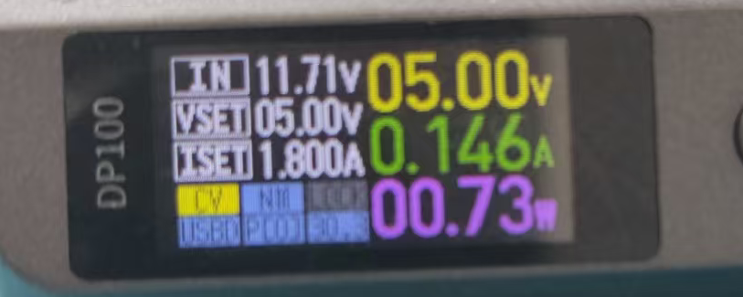
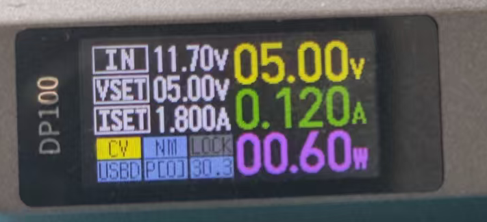

# Sleep低功耗模式

## 简介

演示STM32F429 Sleep模式，按键唤醒。

## 硬件

- 开发板：STM32F429IGT6
- LED：PB1（低电平点亮）
- 按键：PH3（低电平有效）
- 串口：USART1（PA9/PA10）

---

## 原理讲解

### 1. Sleep模式是什么

正常运行时，CPU不停地：
```
取指令 → 译码 → 执行 → 取指令 → 译码 → 执行 → ...
```

Sleep模式就是让CPU**停住不动**，不再取指令执行，从而降低功耗。

### 2. 核心：WFI指令

`HAL_PWR_EnterSLEEPMode` 内部核心就是一条汇编指令：

```c
// HAL库内部
void HAL_PWR_EnterSLEEPMode(uint32_t Regulator, uint8_t SLEEPEntry)
{
    if (SLEEPEntry == PWR_SLEEPENTRY_WFI)
    {
        __WFI();  // Wait For Interrupt
    }
}
```

**WFI = Wait For Interrupt**（等待中断）

执行后CPU就停住了，程序卡在这里不往下走。

### 3. 唤醒机制

CPU停了，但**中断控制器(NVIC)还在工作**。

当外部中断发生：
```
PH3下降沿 → EXTI3检测到 → 向NVIC发中断请求 → NVIC唤醒CPU
```

CPU被唤醒后：
1. 先执行中断服务函数 `HAL_GPIO_EXTI_Callback()`
2. 中断返回后，从WFI的**下一行**继续执行

```c
__WFI();           // CPU停在这里
                   // ↓ 中断唤醒后，从这里继续
HAL_ResumeTick();  // 恢复SysTick
printf("Wakeup");  // 打印
```

### 4. 为什么要暂停SysTick

SysTick默认1ms产生一次中断（给HAL_Delay用）。

如果不暂停：
```
进入Sleep → 1ms后SysTick中断 → 唤醒 → 又Sleep → 1ms后又唤醒 → ...
```

CPU根本睡不着，一直被SysTick吵醒。

### 5. 执行流程

```
        正常运行
            │
            ▼
    HAL_SuspendTick()    ← 关闭SysTick中断
            │
            ▼
        __WFI()          ← CPU停止，卡在这里
            │
            │  (等待中断)
            │
      ┌─────┴─────┐
      │  PH3按下   │      ← 外部中断发生
      └─────┬─────┘
            │
            ▼
    EXTI3_IRQHandler()   ← 中断服务函数
            │
            ▼
  HAL_GPIO_EXTI_Callback()
            │
            ▼
       中断返回
            │
            ▼
    HAL_ResumeTick()     ← 从WFI下一行继续
            │
            ▼
        继续运行
```

### 6. 寄存器层面（不用HAL库）

```c
void Enter_Sleep(void)
{
    // 清除SLEEPDEEP位（Sleep模式）
    SCB->SCR &= ~SCB_SCR_SLEEPDEEP_Msk;

    // 执行WFI
    __WFI();
}
```

### 7. API参数说明

```c
HAL_PWR_EnterSLEEPMode(PWR_MAINREGULATOR_ON, PWR_SLEEPENTRY_WFI);
```

| 参数 | 含义 |
|------|------|
| PWR_MAINREGULATOR_ON | 主稳压器保持开启（Sleep模式固定） |
| PWR_SLEEPENTRY_WFI | 用WFI指令进入 |

---

## Sleep模式特点

| 项目 | 说明 |
|------|------|
| 功耗 | mA级（最高） |
| CPU | 停止 |
| 外设 | 继续运行 |
| RAM | 保持 |
| 唤醒源 | 任意中断 |
| 唤醒时间 | 最快（ns级） |

---

## 实验现象

```
上电 → LED闪烁3次 → 串口打印"Entering Sleep" → 进入Sleep
                                                    ↓
                               按下KEY0 (PH3) 产生中断
                                                    ↓
唤醒 → 串口打印"Wakeup" → LED亮1秒 → LED闪烁3次 → 再次进入Sleep
```
#### 正常运行时：



#### 进入低功耗：



---

## CubeMX配置

详情见 sleepmode.ioc

---

## 注意事项

1. **SysTick必须暂停**：否则1ms就被唤醒
2. **调试器影响功耗**：测量功耗时断开调试器
3. **串口发送完成**：进入Sleep前加延时等待串口发完

---

## 三种低功耗对比

| 模式 | 功耗 | CPU | 外设 | RAM | 唤醒源 |
|------|------|-----|------|-----|--------|
| Sleep | mA | 停 | 运行 | 保持 | 任意中断 |
| Stop | μA | 停 | 停 | 保持 | EXTI/RTC |
| Standby | 最低 | 停 | 停 | **丢失** | WKUP/RTC |
