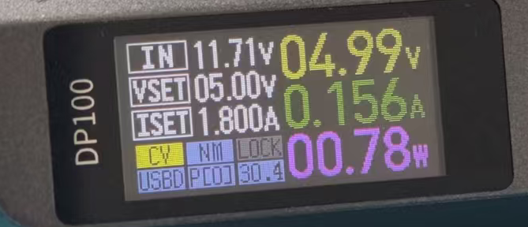

# Stop低功耗模式

## 简介

演示STM32F429 Stop模式，按键唤醒。

## 硬件

- 开发板：STM32F429IGT6
- LED：PB1（低电平点亮）
- 按键：PH3（低电平有效）
- 串口：USART1（PA9/PA10）

---
## 原理讲解

### 1. Stop模式 vs Sleep模式

| 项目 | Sleep | Stop |
|------|-------|------|
| CPU | 停止 | 停止 |
| 外设时钟 | **运行** | **停止** |
| HSE/HSI/PLL | **运行** | **停止** |
| RAM | 保持 | 保持 |
| 功耗 | mA级 | **μA级** |
| 唤醒源 | 任意中断 | **仅EXTI** |

Sleep只是CPU不干活，外设还在跑。
Stop是把时钟都关了，整个芯片几乎都停了。

### 2. 为什么功耗更低

功耗主要来自：
- 时钟树翻转（占大头）
- 外设运行
- CPU运算

Stop模式把时钟关了，功耗直接降到μA级。

### 3. 唤醒源限制

Sleep模式任意中断都能唤醒，但Stop模式**只有EXTI能唤醒**：

| 唤醒源 | 说明 |
|--------|------|
| EXTI线0-15 | 外部GPIO中断 |
| EXTI线16 | PVD输出 |
| EXTI线17 | RTC闹钟 |
| EXTI线18 | USB OTG FS唤醒 |
| EXTI线21 | RTC入侵/时间戳 |
| EXTI线22 | RTC唤醒 |

普通定时器中断、串口中断等**不能唤醒**Stop模式。

### 4. 唤醒后时钟问题（重点！）

进入Stop前：
```
HSE(25MHz) → PLL → SYSCLK(180MHz)
```

Stop模式下：
```
HSE关闭、PLL关闭、HSI关闭 → 全部停止
```

唤醒后：
```
自动切换到HSI(16MHz) → SYSCLK(16MHz)
```

**问题**：唤醒后系统时钟变成16MHz了！串口波特率、定时器都会不对。

**解决**：唤醒后必须调用 `SystemClock_Config()` 重新配置时钟。

### 5. HAL库API

```c
HAL_PWR_EnterSTOPMode(PWR_LOWPOWERREGULATOR_ON, PWR_STOPENTRY_WFI);
```

| 参数 | 选项 | 说明 |
|------|------|------|
| 调节器 | PWR_MAINREGULATOR_ON | 主调节器，唤醒快 |
| | PWR_LOWPOWERREGULATOR_ON | 低功耗调节器，功耗更低 |
| 进入方式 | PWR_STOPENTRY_WFI | Wait For Interrupt |
| | PWR_STOPENTRY_WFE | Wait For Event |

### 6. 寄存器层面

```c
void Enter_Stop(void)
{
    // 设置SLEEPDEEP位（进入深度睡眠）
    SCB->SCR |= SCB_SCR_SLEEPDEEP_Msk;

    // 清除PWR_CR的PDDS位（Stop模式，不是Standby）
    PWR->CR &= ~PWR_CR_PDDS;

    // 设置LPDS位（低功耗调节器）
    PWR->CR |= PWR_CR_LPDS;

    // 执行WFI
    __WFI();

    // 唤醒后清除SLEEPDEEP位
    SCB->SCR &= ~SCB_SCR_SLEEPDEEP_Msk;
}
```

### 7. 执行流程

```
        正常运行 (180MHz)
            │
            ▼
    HAL_SuspendTick()
            │
            ▼
  HAL_PWR_EnterSTOPMode()    ← 时钟全部关闭，CPU停止
            │
            │  (芯片几乎停止，μA级功耗)
            │
      ┌─────┴─────┐
      │  PH3按下   │           ← EXTI3中断唤醒
      └─────┬─────┘
            │
            ▼
    EXTI3_IRQHandler()        ← 此时时钟是HSI(16MHz)
            │
            ▼
  HAL_GPIO_EXTI_Callback()
            │
            ▼
       中断返回
            │
            ▼
    SystemClock_Config()      ← 重新配置到180MHz（重要！）
            │
            ▼
    HAL_ResumeTick()
            │
            ▼
        继续运行 (180MHz)
```

---

## Stop模式特点总结

| 项目 | 说明 |
|------|------|
| 功耗 | μA级 |
| CPU | 停止 |
| 外设 | 停止 |
| 时钟 | 全部停止 |
| RAM | 保持 |
| 唤醒源 | 仅EXTI |
| 唤醒后 | 需重配时钟 |

---

## 运行现象

```
上电 → LED闪烁3次 → 串口打印"Entering Stop" → 进入Stop
                                                  ↓
                             按下KEY0 (PH3) EXTI唤醒
                                                  ↓
唤醒 → 重配时钟 → 串口打印"Wakeup" → LED亮1秒 → 闪3次 → 再次进入Stop
```
#### 正常运行时：



#### 进入Stop模式后：


---

## CubeMX配置

- 详情见[CubeMX配置](stopmode.ioc)

---

## Sleep vs Stop 代码差异

```c
/* Sleep模式 */
HAL_SuspendTick();
HAL_PWR_EnterSLEEPMode(PWR_MAINREGULATOR_ON, PWR_SLEEPENTRY_WFI);
HAL_ResumeTick();

/* Stop模式 */
HAL_SuspendTick();
// API不同，注意！
HAL_PWR_EnterSTOPMode(PWR_LOWPOWERREGULATOR_ON, PWR_STOPENTRY_WFI);
SystemClock_Config();   // ← 多了这一行！
HAL_ResumeTick();
```

Stop模式唤醒后要**重配时钟**。

---

## 注意事项

1. **必须重配时钟**：否则系统运行在HSI 16MHz，串口波特率会错
2. **只有EXTI能唤醒**：普通定时器中断不行
3. **调试器影响**：测量功耗时断开调试器
4. **低功耗调节器**：`PWR_LOWPOWERREGULATOR_ON` 功耗更低，但唤醒稍慢

---

## 功耗对比（典型值）

| 模式 | F429典型功耗 |
|------|-------------|
| 运行 (180MHz) | ~100mA |
| Sleep | ~30mA |
| Stop (主调节器) | ~300μA |
| Stop (低功耗调节器) | ~100μA |
| Standby | ~3μA |

---

## 三种低功耗对比

| 模式 | 功耗 | CPU | 时钟 | RAM | 唤醒源 | 唤醒后 |
|------|------|-----|------|-----|--------|--------|
| Sleep | mA | 停 | 运行 | 保持 | 任意中断 | 直接继续 |
| Stop | μA | 停 | **停** | 保持 | **EXTI** | **重配时钟** |
| Standby | 最低 | 停 | 停 | **丢失** | WKUP/RTC | **复位重启** |
